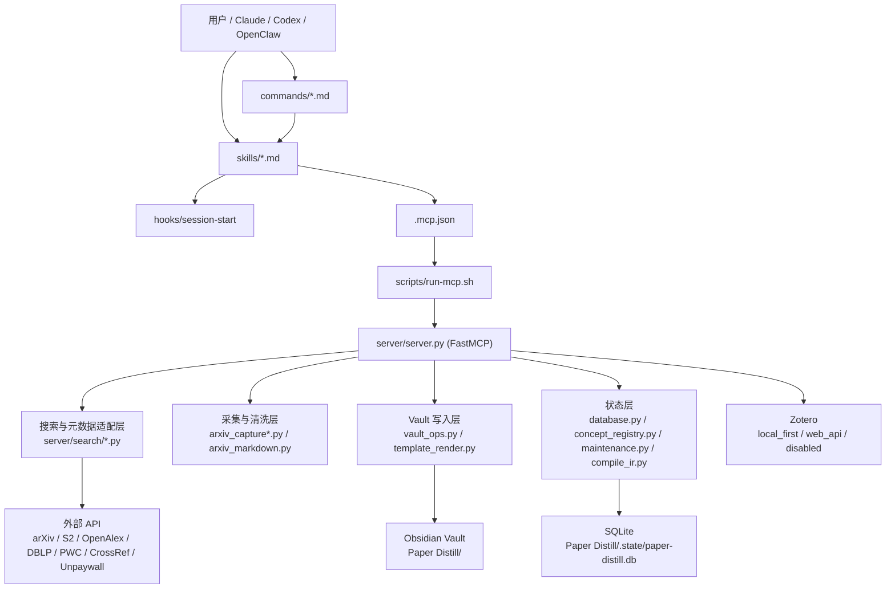

# 系统架构总览

- 文档类型：参考文档
- 状态：当前
- 版本：v2.1.0 实现参考
- 更新日期：2026-04-07
- 适用对象：维护者、集成方、二次开发者

## 文档目标

这份文档不是产品介绍，而是对当前仓库实现的“代码级地图”。

它重点回答 5 个问题：

1. 这个库在运行时由哪些层组成
2. 数据实际落在哪里、是什么格式、由谁写入、由谁消费
3. 命令、skills、MCP tools、Vault、SQLite 之间如何串联
4. discovery / ingest / compile / query / maintenance 的真实链路是什么
5. 哪些行为是代码强约束，哪些只是 skill 层的工作流约定

## 一句话理解

Paper Distill 是一个“面向 Obsidian 的研究知识维护系统”：

- 客户端侧通过 plugin bundle、commands、skills、agents 与用户交互
- 运行时核心是一个 FastMCP server
- 持久化核心分成两层：
  - Vault 文件层：Markdown + YAML frontmatter + JSON sidecar
  - 状态数据库层：`Paper Distill/.state/paper-distill.db`
- 高层工作流由 skill 编排，底层确定性动作由 MCP tool 执行

## 总体分层



## 仓库目录与职责

### 顶层目录

| 路径 | 作用 |
| --- | --- |
| `server/` | MCP server 与主要业务逻辑 |
| `server/search/` | 学术搜索源适配器与结果合并逻辑 |
| `server/zotero/` | Zotero handoff 实现 |
| `templates/` | Markdown 渲染模板 |
| `skills/` | 高层工作流规范，决定 agent 如何调 MCP tools |
| `commands/` | 用户可触发命令，通常映射到某个 skill |
| `agents/` | 子代理角色定义，偏“工作说明书” |
| `docs/` | 面向用户与维护者的文档 |
| `hooks/` | 会话启动时注入上下文 |
| `scripts/` | MCP launcher 与 bootstrap 脚本 |
| `tests/` | 子系统回归测试 |
| `.mcp.json` | 统一 MCP 入口定义 |
| `.codex-plugin/` / `.claude-plugin/` | 多客户端 plugin manifest |
| `settings.example.json` | 配置模板 |
| `settings.json` | 本地实际配置，默认不进版本控制 |

### `server/` 内部模块分工

| 模块 | 作用 |
| --- | --- |
| `server.py` | FastMCP 入口，暴露 33 个 tools，编排主要流程 |
| `config.py` | 配置读取、默认值、环境变量覆盖 |
| `vault_ops.py` | Vault 目录初始化、frontmatter 写入、模板渲染入口 |
| `vault_query.py` | 供 AI 读取 Vault 状态的标准接口 |
| `vault_lint.py` | 纯读的结构健康检查与知识图分析 |
| `database.py` | SQLite schema、连接、authority export/import |
| `concept_registry.py` | 概念注册表、别名、合并、提升 |
| `maintenance.py` | maintenance queue 的 reconcile 与执行控制器 |
| `compile_ir.py` | EDC 编译协议中的 IR 持久化、解析、提交 |
| `paper_utils.py` | 论文 ID、URL、venue 规范化工具 |
| `arxiv_capture.py` | arXiv 绑定、正文抓取、清洗、CRGP-DNL 生成 |
| `arxiv_html_fetch.py` | 原生 arXiv HTML -> ar5iv fallback |
| `arxiv_html_parser.py` | 抽取标题、摘要、正文 article 节点 |
| `arxiv_markdown.py` | HTML/Math/Table -> Markdown 转换 |
| `template_render.py` | Jinja2 模板渲染 |

## 运行时入口链路

### 1. 多客户端共用一个 MCP runtime

当前仓库并不为 Claude / Codex / OpenClaw 各维护一套 server，而是统一走：

1. `.codex-plugin/plugin.json` 或 `.claude-plugin/plugin.json`
2. `.mcp.json`
3. `scripts/run-mcp.sh`
4. `uv run paper-distill-server`
5. `server.server:main`

也就是说，客户端差异主要体现在：

- 插件 manifest 识别
- hook 机制
- skills / commands / agents 的消费方式

而不是后端实现差异。

### 2. SessionStart hook 的作用

`hooks/session-start` 会把 `skills/using-paper-distill/SKILL.md` 注入会话上下文。

它的意义是：

- 一进入会话就告诉 agent：当前安装了 Paper Distill
- 让 agent 知道 approval boundary、Vault 结构、推荐 skill
- 把“怎么使用这个系统”的协议前置，而不是靠用户每次重复提醒

### 3. 高层工作流不完全等于 MCP tools

这是本库最重要的架构事实之一：

- `/discover`、`/process-inbox`、`/add-paper` 有对应的核心 MCP tools
- 但 `/compile`、`/query`、`/ideas`、`/digest` 更像“skill 驱动的工作流”
- 它们往往会组合多个 MCP tools，再配合 agent 直接读写 Markdown 文件

所以本库是一个混合架构：

- **确定性层**：MCP tools 负责纯 Python、可测试、结构化的操作
- **编排层**：skills 负责“什么时候调用什么 tool、如何组织最终产物”

## 配置系统

### 配置来源与优先级

配置主要来自：

1. `settings.json`
2. 环境变量

补充一点：

- `SETTINGS_PATH` 可以覆盖配置文件位置
- `config.load_settings()` 带 `lru_cache`
- 运行时更新 `settings.json` 后，需要清缓存或重启会话才能读到新值

### 关键配置块

| 配置块 | 作用 |
| --- | --- |
| `vault_path` | Obsidian Vault 根目录 |
| `topics` | discovery、idea、query 的主题上下文 |
| `search` | 搜索源与每主题抓取数量 |
| `workflow` | inbox 卡片密度、多样性上限、是否强制 arXiv binding |
| `capture` | arXiv / PDF 清洗策略、图表公式保留策略 |
| `scoring` | discovery 打分权重、venue alias、venue tier |
| `compile` | 编译策略开关 |
| `venue.authority_order` | 多源元数据冲突时 venue 的优先级 |
| `zotero` | Zotero 模式与导出位置 |
| `research_profile` | 用户研究方向、白名单作者、seed papers、学习到的偏好 |

### 配置格式

`settings.json` 的核心结构是：

```json
{
  "paper_distill": {
    "vault_path": "/absolute/path/to/vault",
    "topics": {
      "vision-language-action": {
        "label": "Vision-Language-Action",
        "keywords": ["VLA", "vision language action"],
        "weight": 1.0
      }
    },
    "research_profile": {
      "direction": "Embodied AI ...",
      "whitelist_authors": [],
      "seed_papers": [],
      "learned_preferences": {
        "accepted_keywords": [],
        "rejected_keywords": [],
        "preferred_venues": [],
        "feedback_count": 0
      }
    }
  }
}
```

### 与版本控制的关系

- `settings.json` 被 `.gitignore` 忽略
- 这是本地环境配置，不应作为仓库公共状态提交

## 持久化设计总览

系统的持久化不是单一数据库，而是 4 类资产共同组成：

1. Vault Markdown 笔记
2. Vault JSON sidecar / IR 文件
3. SQLite 状态数据库
4. 配置与插件清单文件

## Vault 文件层

Paper Distill 在 Obsidian Vault 内固定使用：

```text
{vault}/Paper Distill/
├── inbox/
├── raw/
│   ├── source/
│   └── notes/
├── zotero/
│   └── imports/
├── wiki/
│   ├── papers/
│   ├── concepts/
│   ├── methods/
│   └── topics/
├── compiled_ir/
├── queries/
├── daily-log/
├── index.md
├── log.md
└── .state/
```

### 1. `inbox/`

**存储格式**

- Markdown
- YAML frontmatter + 模板正文
- 路径按日期切分：`inbox/{YYYY-MM-DD}/{paper_id}.md`

**主要内容**

```yaml
paper_id:
status:
title:
authors:
year:
doi:
arxiv_id:
sources:
venue_raw:
venue_normalized:
venue_tier:
best_topic:
matched_topics:
score_total:
score_breakdown:
arxiv_binding_status:
capture_status:
capture_error:
summary:
abstract:
why_recommended:
raw_source_path:
raw_note_path:
zotero_mode:
zotero_status:
retrieved_at:
decision_note:
```

**作用**

- 作为 discovery 与正式知识库之间的人类审批边界
- 允许用户通过 `status` 手动决定候选去向

**谁写入**

- `discover_papers(save_to_inbox=true)`

**谁消费**

- 人类在 Obsidian 中审批
- `process_inbox(status="approved")`

### 2. `raw/source/`

**存储格式**

- Markdown
- YAML frontmatter + inline evidence body
- 默认按日期切分：`raw/source/{YYYY-MM-DD}/{citekey}.md`

**主要内容**

frontmatter 典型字段：

```yaml
paper_id:
citekey:
title:
authors:
year:
doi:
arxiv_id:
venue:
venue_normalized:
venue_tier:
venue_source:
topics:
canonical_html_url:
canonical_pdf_url:
capture_method:
capture_fidelity:
capture_source:
appendix_policy:
source_structured_path:
figure_count:
table_count:
equation_count:
captured_at:
compiled:
```

正文特点：

- 不是简单 PDF 文本 dump
- 是经过 arXiv/ar5iv HTML 清洗后的 Markdown
- 图、表、公式尽量贴近正文位置内联
- 结尾可附加 `## Captured Assets Index`
- 追加 `Structured data: ...assets.json` 指向 sidecar

**作用**

- 作为“稳定证据层”
- 为 CRGP-DNL、编译、query、idea 提供上游依据

**谁写入**

- `process_inbox`
- `add_paper`

**谁消费**

- `build_crgp_dnl`
- `wiki-compile` skill 的深编译阶段
- 人工核对原文证据

### 3. `raw/source/*.assets.json`

**存储格式**

- JSON sidecar

**主要内容**

```json
{
  "title": "",
  "abstract": "",
  "capture_fidelity": "high|low|unknown",
  "capture_source": "arxiv_native_html|ar5iv_html|pdf_text|...",
  "capture_method": "arxiv_native_html_cleaned|ar5iv_html_cleaned|pdf_text_recovered",
  "quality": {},
  "sections": [],
  "appendix_snapshot": [],
  "figures": [],
  "tables": [],
  "equations": []
}
```

**作用**

- 作为结构化证据主契约
- 比 Markdown 正文更适合程序读取图表、公式、节信息和 capture provenance

**谁写入**

- `_write_ingestion_outputs()`，前提是 `capture.write_structured_sidecar=true`

**谁消费**

- 编译、后续结构化分析、精细证据引用

### 4. `raw/notes/`

**存储格式**

- Markdown
- YAML frontmatter + CRGP-DNL 正文
- 路径：`raw/notes/{YYYY-MM-DD}/{citekey}.md`

**主要内容**

frontmatter 典型字段：

```yaml
paper_id:
citekey:
title:
authors:
year:
doi:
arxiv_id:
venue:
topics:
source_raw_path:
source_structured_path:
zotero_mode:
zotero_status:
zotero_import_path:
zotero_uri:
zotero_key:
capture_fidelity:
note_framework: CRGP-DNL
confidence:
compiled:
updated_at:
```

正文固定按照 CRGP-DNL 渲染：

- Context
- Related Work
- Gap
- Proposal
- Key Results
- Discussion
- Next Steps

每段还带 evidence line，用于说明其证据来源段落。

**作用**

- 作为“阅读理解层”
- 把证据层转成面向当前研究方向的结构化摘要

**谁写入**

- `build_crgp_dnl()` + `_write_ingestion_outputs()`

**谁消费**

- `wiki-compile` skill
- query / idea 时的补充证据

### 5. `wiki/`

`wiki/` 是编译层，不是直接摄取层。

子目录职责：

| 路径 | 作用 |
| --- | --- |
| `wiki/papers/` | 单论文编译页 |
| `wiki/concepts/` | 概念页 |
| `wiki/methods/` | 方法比较页 |
| `wiki/topics/` | 主题/landscape 页 |

**重要事实**

- 仓库里没有一个“单独的 compile MCP tool”一键生成整个 wiki
- `/compile` 主要由 `skills/wiki-compile/SKILL.md` 定义编排方式
- 底层真正的写入出口通常是：
  - `upsert_wiki_article()`：通用安全写入
  - `commit_compile_result()`：带 compile_state / deps 记录的 EDC Write

**代码强约束**

- `upsert_wiki_article(section="papers")` 至少要求 frontmatter 含 `citekey` 和 `title`
- `upsert_wiki_article(section="concepts")` 至少要求 `concept`
- `commit_compile_result()` 会把 body 中的 managed blocks 记录入 SQLite，并进行冲突检测

**skill 约定而非底层强校验**

- wiki paper 页通常应包含 `topics`、`concepts`、`limitations`、`open_questions`、`source_raw_path`、`source_note_path`、`compiled` 等字段
- raw note 的 `compiled: true` 通常由 compile skill 在编译完成后回写
- 每篇 paper 应链接至少 2 个 concept

### 6. `compiled_ir/`

这是 EDC 编译协议的中间产物层。

#### `compiled_ir/{citekey}.json`

**作用**

- Extract 阶段输出
- 由 agent/LLM 从 raw notes 中抽取结构化 IR

**最低要求**

```json
{
  "citekey": "",
  "title": "",
  "authors": [],
  "candidate_concepts": [],
  "tension_fields": {
    "limitations": [],
    "assumptions": [],
    "open_questions": [],
    "negative_results": []
  }
}
```

可选增强字段：

- `failure_modes`
- `transfer_constraints`
- `benchmark_scope`
- `claimed_novelty`

#### `compiled_ir/{citekey}_resolved.json`

**作用**

- Resolve 阶段输出
- `candidate_concepts` 被映射到 concept registry 的 canonical IDs

**典型附加字段**

- `_resolved: true`
- `_resolutions: [...]`

### 7. `queries/`

**存储格式**

- Markdown
- YAML frontmatter + Query Asset 正文模板

**主要 frontmatter 字段**

```yaml
type:
title:
question:
date:
source_pages:
papers_referenced:
concepts_referenced:
topics_referenced:
derived_actions:
promotion_targets:
status:
```

常见类型：

- `query-note`
- `comparison-note`
- `topic-synthesis`
- `contradiction-note`
- `idea-analysis`
- `idea-memo`

**作用**

- 保存高价值查询与 idea 结果
- 作为未来 promotion / compile / maintenance 的输入信号

**重要点**

- 这部分更多由 skill 编排和 agent 文件写入生成
- server 里提供了前端体例 helper，但没有单独的 `save_query_asset` MCP tool

### 8. `daily-log/`

**存储格式**

- Markdown
- 通常按 `daily-log/{YYYY-MM-DD}.md`

**作用**

- 记录每日 discovery digest
- 作为日级视角的候选审阅入口

这也是 skill 驱动的工作流产物，而不是单独 tool 的直接输出。

### 9. `index.md`、`log.md` 与 `_index.md`

三者不是一回事：

| 文件 | 作用 |
| --- | --- |
| `index.md` | 内容导向全局导航，由 `refresh_global_navigation()` 重建 |
| `log.md` | 事件时间线，由 `append_knowledge_log()` 追加 |
| `_index.md` | 分区 Dataview 索引，主要给 Obsidian UI 使用 |

**关键约定**

- AI 不应该把 `_index.md` 当数据源解析
- AI 标准读取入口应该是 `query_vault()`

## SQLite 状态层

数据库路径：

- `Paper Distill/.state/paper-distill.db`

特点：

- 使用 SQLite + WAL
- 按 `vault_path` 维护单例连接
- authority layer 和 rebuildable index layer 分离
- `.gitignore` 显式排除了 `Paper Distill/.state/`

### 表设计

| 表名 | 层级 | 存储内容 | 作用 | 可否重建 |
| --- | --- | --- | --- | --- |
| `concept_registry` | authority | canonical concept/topic/method | 概念主表 | 不建议丢失 |
| `concept_aliases` | authority | alias -> concept_id | 名称归一化 | 不建议丢失 |
| `concept_merge_history` | authority | merge trace | 审计与追溯 | 不建议丢失 |
| `maintenance_queue` | authority | 待执行维护任务 JSON | 维护控制面 | 不建议丢失 |
| `compile_state` | rebuildable | 每页 compile_version、schema_version、ir_path、managed hash | 编译状态与冲突检测 | 可重建 |
| `compile_deps` | rebuildable | page -> concept/method/topic 依赖 | 反向依赖与维护影响范围 | 可重建 |

### authority layer 与 rebuildable layer 的边界

这是系统设计里的核心思想：

- **authority layer**
  - 记录“必须被保留的人类/系统裁决”
  - 如 canonical concept、merge 决策、maintenance queue
- **rebuildable index layer**
  - 记录“可从 Vault + IR 重推导的状态”
  - 如 compile_state、compile_deps

因此：

- `export_db_state()` 只导出 authority tables
- `backfill_registry()` 用于从既有 wiki 回填 registry / deps

## 插件与清单文件

除了 Vault 与 DB，本仓库还有几类“运行时描述文件”：

### `.mcp.json`

作用：

- 定义 MCP server 名称、启动命令、环境变量透传

特点：

- 统一使用 `/bin/bash -lc ... scripts/run-mcp.sh`
- 尝试兼容 `CLAUDE_PLUGIN_ROOT` / `CODEX_PLUGIN_ROOT` / `OPENCLAW_PLUGIN_ROOT`

### `.codex-plugin/plugin.json`

作用：

- Codex 侧的插件 manifest
- 声明 skills、hooks、mcpServers、UI 元数据

### `.claude-plugin/plugin.json`

作用：

- Claude 兼容 manifest

### `hooks/hooks.json`

作用：

- 把 `SessionStart` 事件绑定到 `hooks/session-start`

## 外部依赖与外部系统

### 学术搜索与元数据源

`server/search/*.py` 适配了：

- arXiv
- Semantic Scholar
- OpenAlex
- DBLP
- Papers with Code
- CrossRef
- Unpaywall

### 正文抓取与证据采集

- 原生 arXiv HTML
- ar5iv HTML
- PDF 文本 fallback

### Zotero

模式：

- `local_first`
- `web_api`
- `disabled`

职责：

- 给 raw layers 提供 bibliographic grounding
- 不作为唯一知识库，而是 handoff 目标

## 核心链路详解

### 1. Bootstrap 链

```text
bootstrap_vault / scripts/bootstrap.sh
-> ensure_vault_structure()
-> 创建目录
-> 创建 _index.md / index.md / log.md
-> 初始化 SQLite
```

作用：

- 为一个新的 Obsidian Vault 注入标准骨架
- 建立后续所有链路的路径契约

### 2. Discovery 链

```text
/discover
-> commands/discover.md
-> skills/paper-discover
-> discover_papers()
-> search_papers()
-> score_papers()
-> bind_paper_to_arxiv()
-> write inbox notes
```

### discovery 的真实步骤

1. 读取 `topics`、`scoring`、`research_profile`
2. 对每个 topic 构造 query
3. 并行调用多个搜索源
4. `dedup_merge()` 合并多源结果
5. `score_papers()` 做确定性打分
6. 做 discovery drift 诊断，必要时第二轮 refined search
7. 默认要求候选成功绑定 arXiv
8. 只把通过筛选的论文写入 `inbox/`

### 关键设计

- discovery 永远不直接写 `raw/`
- `require_arxiv_binding=true` 时，候选必须具有稳定 arXiv 绑定
- `known_ids` 会去重已在 inbox/raw/wiki 中存在的论文

### 3. Inbox 处理链

```text
用户把 inbox frontmatter.status 改成 approved
-> /process-inbox
-> query_vault(section="inbox", status="approved")
-> process_inbox()
-> _prepare_ingestion_candidate()
-> capture_arxiv_source() / PDF fallback
-> build_crgp_dnl()
-> zotero_add()
-> 写 raw/source + .assets.json + raw/notes
-> 回写 inbox frontmatter
-> append_knowledge_log()
-> refresh_global_navigation()
```

### 失败语义

- capture 失败：
  - 不写 raw 层
  - 在 inbox note 上写 `capture_status=failed` 与 `capture_error`
- Zotero 失败（`process_inbox` 路径）：
  - 也会把这次处理视为失败
  - 不进入最终 raw 写入阶段

也就是说，`process_inbox` 比 `add_paper` 更保守。

### 4. Direct Add 链

```text
/add-paper
-> commands/add-paper.md
-> skills/paper-add
-> add_paper(identifier)
-> _resolve_explicit_paper()
-> _find_existing_paper()
-> _prepare_direct_add_candidate()
-> build_crgp_dnl()
-> zotero_add()
-> 写 raw/source + .assets.json + raw/notes
-> append_knowledge_log()
```

### 与 `process_inbox` 的差异

| 维度 | `process_inbox` | `add_paper` |
| --- | --- | --- |
| 上游来源 | 人工审批过的 inbox note | 用户明确确认的一篇论文 |
| 是否经过 inbox | 是 | 否 |
| topic 标记 | 来自 inbox `matched_topics` | 自动重新匹配 `topic_keys` / settings topics |
| Zotero 失败处理 | 更保守，常直接视为失败 | raw 层仍保留，但返回 warning |

### 5. 采集与清洗链

```text
paper metadata
-> bind_paper_to_arxiv()
-> fetch_arxiv_html_with_fallback()
-> parse_arxiv_html_document()
-> clean_ar5iv_html()
-> CleanedArxivDocument
-> build_raw_source_body()
-> _source_doc_sidecar_payload()
```

### `CleanedArxivDocument` 是什么

它是采集层的统一中间对象，字段包括：

- `title`
- `abstract`
- `markdown`
- `sections`
- `appendix_snapshot`
- `quality`
- `figures`
- `tables`
- `equations`
- `capture_fidelity`
- `capture_source`
- `capture_method`

### Capture fidelity

- `high`
  - 来自原生 HTML 或 ar5iv HTML 清洗
- `low`
  - 来自 PDF 文本回收

### 6. Compile 链

### 非常重要：`/compile` 不是单一 MCP tool

用户看到的是 `/compile`，但后端实现不是一个叫 `compile()` 的 server tool。

实际链路是：

```text
/compile
-> commands/compile.md
-> skills/wiki-compile
-> query_vault(uncompiled raw notes)
-> LLM 读取 raw/source + raw/notes
-> write_compile_ir()
-> resolve_compile_ir()
-> get_maintenance_queue() / execute_maintenance_task()
-> commit_compile_result()
-> agent 视情况回写 raw note 的 compiled=true
```

### EDC 三阶段

#### Extract

- LLM 读取 raw notes/source
- 生成 `compiled_ir/{citekey}.json`

#### Resolve

- 纯 Python
- 通过 concept registry 解析 `candidate_concepts`
- 产出 `compiled_ir/{citekey}_resolved.json`

#### Write

- 通过 `commit_compile_result()` 写入 wiki
- 同步更新 `compile_state` 与 `compile_deps`

### `commit_compile_result()` 的关键能力

这一步不是普通写文件，而是带编译语义的提交：

- 写目标 markdown
- 提取并记录 managed blocks
- 计算 content hash
- 持久化 compile version
- 持久化依赖关系
- 做三方合并与冲突检测
- 保留 `## My Notes` / `## Reading Notes` 这样的用户后缀区块

这意味着：

- 机器管理的内容可更新
- 用户手写笔记区尽量保留
- 当 managed block 被手改且无法安全 merge 时，会返回 `conflict_detected`

### 7. Query 链

```text
/query
-> commands/query.md
-> skills/knowledge-query
-> query_vault()
-> 读取 wiki / raw
-> LLM 综合回答
-> 写入 queries/*.md
-> 可能提出 promotion targets
```

### 特点

- query 不是“调用一个 QA tool 返回字符串”
- 它是“先查结构化知识，再让结果沉淀成资产”
- 保存到 `queries/` 的动作主要发生在 skill + agent 文件写入层

### 8. Idea 链

```text
/ideas
-> skills/idea-generator
-> analyze_knowledge_graph()
-> query_tension_signals()
-> query_trigger_candidates()
-> LLM 解释图谱缺口与张力
-> 写 idea-analysis / idea-memo 到 queries/
-> 必要时 enqueue_maintenance_task()
```

### idea 的两个数据来源

- 图结构分析：
  - methodology mismatches
  - combination opportunities
  - recurring problems
  - scaling questions
- IR 张力分析：
  - recurring limitations
  - open question clusters
  - negative results
  - failure modes
  - transfer constraints
  - contradiction candidates

### 9. Lint / Maintenance 链

```text
lint_vault()      # 纯读
vault_stats()     # 纯读
-> reconcile_maintenance()
-> maintenance_queue
-> get_maintenance_queue()
-> execute_maintenance_task()
```

### maintenance 的设计原则

- `lint_vault()` 本身不应有副作用
- 真正写 queue 的是 `reconcile_maintenance_queue()`
- queue 会做 dedup
- task 需要 `confirmed` 才能执行

### 控制器能力

#### `execute_merge`

- 合并 concept registry 记录
- 重写 compile_deps
- 重写受影响页面中的 wikilinks

#### `execute_promote`

- 把 concept 提升为 topic
- 重写相关依赖和链接
- 生成 topic 页并把旧 concept 页改成 redirect

#### `execute_refresh`

- 保守刷新 topic 页摘要
- 若目标 topic 页不存在，则阻塞任务

### 10. Learned Preferences 更新链

```text
update_learned_preferences()
-> 读 settings.json
-> append accepted/rejected/preferred_venues
-> feedback_count +1
-> 写回 settings.json
-> clear load_settings cache
```

这条链让 discovery 的打分体系可以随着用户反馈逐步调整。

## MCP Tools 全量分组

当前 `server/server.py` 暴露的 MCP tools 可以按职责理解为以下几组。

### 搜索与元数据

- `search_papers`
- `resolve_metadata`
- `fetch_pdf_text`
- `score_papers`
- `discover_papers`

### Vault 与基础查询

- `query_vault`
- `bootstrap_vault`
- `lint_vault`
- `vault_stats`
- `analyze_knowledge_graph`
- `update_learned_preferences`
- `upsert_wiki_article`

### 摄取与 Zotero

- `zotero_add`
- `zotero_search`
- `process_inbox`
- `add_paper`

### Concept Registry 与维护控制面

- `register_concept_tool`
- `resolve_concept_tool`
- `merge_concepts_tool`
- `list_concepts_tool`
- `reconcile_maintenance`
- `get_maintenance_queue`
- `resolve_maintenance_task`
- `execute_maintenance_task`
- `enqueue_maintenance_task`
- `export_db_state`
- `backfill_registry`

### 编译与 IR

- `write_compile_ir`
- `resolve_compile_ir`
- `commit_compile_result`
- `query_tension_signals`
- `get_compile_state`
- `query_trigger_candidates`

## Skills / Commands / Agents 的角色边界

### commands

`commands/*.md` 是用户命令入口，主要做两件事：

- 声明命令名与说明
- 指定应触发哪个 skill

例如：

- `/discover` -> `paper-discover`
- `/process-inbox` -> `process-inbox`
- `/compile` -> `wiki-compile`
- `/query` -> `knowledge-query`

### skills

`skills/*.md` 决定 agent 应该怎样使用系统。

它们定义的是：

- 应读哪些配置
- 该调用哪些 tools
- 什么时候应该写 Vault 文件
- 什么时候应该让人审批

也因此，skill 是“系统行为协议”的很大一部分，不只是提示词附件。

### agents

`agents/*.md` 是可选子代理说明：

- `searcher.md`
- `reviewer.md`
- `compiler.md`

它们不是 server 逻辑，而是将工作进一步分工的“角色模板”。

## 关键设计约束与系统不变量

1. `inbox/` 是唯一明确的人类审批边界。
2. discovery 只推荐，不直接生成正式知识。
3. `raw/source` 是证据层，`raw/notes` 是理解层，`wiki/` 是编译层。
4. AI 读取 Vault 状态时应优先使用 `query_vault()`，而不是解析 `_index.md`。
5. SQLite authority layer 代表裁决；rebuildable layer 代表索引。
6. 高价值 query / idea 结果应沉淀为 `queries/` 资产，而不是停留在聊天里。
7. `commit_compile_result()` 是 compile-aware 的唯一严肃写出口，支持 managed blocks 与冲突检测。
8. Concept merge 只允许三类自动合并：
   - slug 相同
   - 硬编码缩写白名单
   - 英美拼写变体
9. Discovery 默认要求 arXiv binding，因此很多非 arXiv 结果只用于搜索阶段，不进入正式 inbox。
10. 系统并不把 Zotero 当主数据库；它只是 handoff 目标之一。

## 测试布局

测试文件大致覆盖以下子系统：

| 测试文件 | 覆盖内容 |
| --- | --- |
| `tests/test_arxiv_capture.py` / `test_arxiv_markdown.py` / `test_arxiv_html_fetch.py` | HTML 抓取、清洗、Markdown 转换 |
| `tests/test_merger.py` / `test_scoring.py` | 多源去重与 discovery 打分 |
| `tests/test_paper_add.py` | direct add、capture sidecar、Zotero handoff 语义 |
| `tests/test_server_tools.py` | MCP tools 集成回归 |
| `tests/test_vault_query.py` / `test_vault_lint.py` | Vault 读取与健康检查 |
| `tests/test_compile_ir.py` / `test_compile_patch_engine.py` | EDC IR、compile state、managed block merge |
| `tests/test_registry_maintenance.py` / `test_maintenance_execution.py` | concept registry、maintenance queue、执行控制器 |
| `tests/test_trigger_candidates.py` | idea / maintenance 触发器 |
| `tests/test_productization.py` | query asset、导航与 log 行为 |

## 维护者最容易误解的几点

### 1. `/compile` 不是后端单一 API

它本质是：

- skill 协议
- agent 读取 raw 层
- 多个底层 tool 协作

### 2. `_index.md` 不是机器数据源

它主要是给 Obsidian Dataview 用的 UI 文件。

### 3. Query/Idea 保存结果，很多时候不是通过 MCP tool 完成的

server 提供了 helper 和读取接口，但高层资产落库经常由 agent 直接写 Markdown。

### 4. DB 不是“全部真相”

很多关键事实仍然存在于 Vault 文件中：

- 原始证据
- 阅读理解
- wiki 正文
- query assets

数据库更像“控制面与索引面”。

### 5. 这套系统既是产品仓库，也是 agent workflow 仓库

仓库里真正决定行为的，不止 Python 代码，还包括：

- `commands/`
- `skills/`
- `agents/`
- `hooks/`

把它们删掉或改错，会改变整个系统的实际运行方式。

## 与历史文档的关系

`docs/archive/` 保留了旧设计、计划和评审。

它们有价值，但默认不应视为当前实现契约。

如果当前实现与历史设计冲突，应以：

1. `server/` 代码
2. `skills/` 当前 workflow
3. `templates/` 当前输出结构

为准。

## 相关文档

- [configuration.md](configuration.md)
- [vault-layout.md](vault-layout.md)
- [commands.md](commands.md)
- [../product/overview.md](../product/overview.md)
- [../product/workflow.md](../product/workflow.md)
- [../product/knowledge-model.md](../product/knowledge-model.md)
