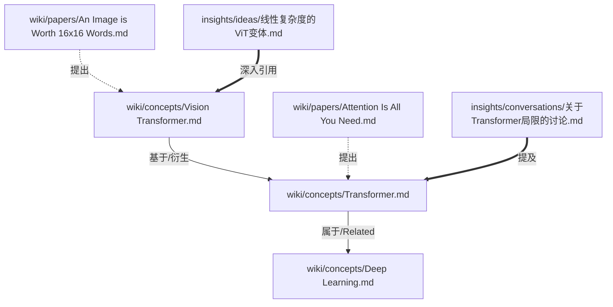

# Paper Distill v3.0 极简功能架构设计

## 核心设计哲学
摒弃复杂的 JSON IR、SQLite 状态机和重度工程化流水线，全面回归 **“Markdown 文件即数据库 (Single Source of Truth)”**的个人知识管理核心。
系统的运转依赖于高度的分工：Agent 负责“大脑”的读写与思考，Python 脚本负责“手脚”的安全执行与外部抓取，QMD 负责极其庞大文件库的“神经”级毫秒检索。

---

## 角色与职责边界 (Responsibilities)

### 1. LLM Agent (大脑)
*   **阅读与理解**：阅读原始证据文献，严格按照 `7 CRGP sections` 格式提取关键信息。
*   **知识图谱构建**：在输出内容时，Agent 负责抽取实体，并在正文中自动插入“稀疏、语义驱动”的 Obsidian 双链（不再依赖 Python 页脚批量注链）。
*   **判断与决策**：判断概念是否同一（同义词识别）、发掘研究空白（Tension）、提出新 Idea。
*   **自我审查验证**：生成 Idea 后，挂载 Reviewer Subagent 进行自我红队攻击，并通过原生 Web Search 验证新颖度。
*   **交互与记忆**：在与用户的对话中，自主决定何种对话属于“重要洞见(Insight)”，并主动发大招保存为双链记忆日志。

### 2. Python Scripts / MCP Tools (手脚与护栏)
*   **网络抓取与清洗**：提供接口抓取 Arxiv/DOI。将不可读的 HTML 转为干净的 Markdown。
*   **防呆写锁 (Safe I/O)**：采用 Python 负责写入。因为长文本 (含 LaTeX) 通过 CLI 等传递易崩溃；且 Python 能利用 `ruamel.yaml` 无损合并 YAML。Python 将承担强制的 Schema 校验与最小 Frontmatter 约束。
*   **写入边界**：Python 仅负责无损合并、Schema 校验、原子落盘与索引调度，不再在正文或页脚自动注入双链。
*   **底层物理修改**：执行全局正则替换工作。比如在合并同一概念时，由 Python 在全库物理替换 `[[旧概念]]` 为 `[[新概念]]`。

### 3. qmd 本地搜索引擎 (神经查询网络)
*   **混合语义大模型搜索**：采用 `qmd`（BM25 + 向量检索）作为主力搜索工具，提供极其精准的全文上下文段落切片。无需开启 Obsidian 即可在后台高速运行，完美解决 4000+ 文献的上下文撑爆问题，Agent 可以作为原生工具直接调用。
*   **轻量级本地解析辅助**：对于检查死链、提取 `aliases` 兼容表映射这一类极简需，依靠 Python 扫描 YAML 表头建立本地词典，彻底抛弃任何笨重的底层依赖。

---

## 目录结构约束

```text
Paper Distill/
├── vault-log.md            # (Python追加) [不入索引] 知识库全局只读时间线日志 (Agent找回心流的锚点)
├── inbox/                  # [不入索引] 待人工审批的轻度摘要存根
├── raw/
│   └── evidence/           # [★ QMD raw 集合・默认排除] 经过审批/抓取转换而来的完整长文原稿 (备用深挖检索区)
├── wiki/
│   ├── papers/             # (Agent写入) [★ QMD canon 集合・默认索引] 规范化的论文核心知识
│   ├── concepts/           # (Agent写入) [★ QMD canon 集合・默认索引] 统一结构概念与别名池
│   └── index.md            # (Obsidian Dataview渲染) [绝不入库] 纯人类视角的免维护动态大盘
├── insights/
│   ├── ideas/              # (Agent写入) [★ QMD insights 集合・默认排除] 原创的初步理论假说
│   └── conversations/      # (Agent写入) [★ QMD insights 集合・默认排除] 和用户的关键对白备份
├── exports/
│   └── presentations/      # (Agent写入) [不入索引] 使用 Marp 语法生成的 PPT/幻灯片交付物
├── .state/
│   └── seen_papers.json    # (Python维护) [不入索引] 最轻量的抓取查重缓存
└── scripts/
    └── mcp_tools/          # (Python提供) 给 Agent 调用的极简 MCP 工具
```

---

## 核心工作流设计 (The 4 Phases)

### Phase 1: 发现与收件箱 (Discovery & Inbox - 宽进严出)
1.  **自动发现 (Script)**：agent 调用 Python 脚本向外请求文献平台，获取新发布的论文。
2.  **去重缓存机制 (Script)**：为降低系统复杂度，使用 `.state/seen_papers.json` 作为唯一的轻量缓存。
    *   **缓存格式 (Key-Value 序列)**：
        ```json
        {
          "arxiv:2410.24164": { "added_at": "2026-04-13", "score": 85 },
          "doi:10.1109/CVPR.2025.1234": { "added_at": "2026-04-12", "score": 70 }
        }
        ```
    *   脚本在处理新一批数据时先比对此文件，见过的直接丢弃。
3.  **投递存根 (Script)**：打分达标的，在 `inbox/` 下生成轻型 MD 文件。
4.  **人工审批 (User)**：在 Obsidian 中浏览，加盖 `#approved` 标签。
5.  **手动快车道 (System)**：用户向 Agent 直接发送论文链接或提出入库要求，Agent 跳过 Inbox 步骤，跨越直接唤起抓取入库。

### Phase 2: 入库与知识编译 (Ingestion & Compilation - 一步到位)
1.  **全文获取与固化 (Script)**：由 Agent 触发（快车道），找到带有 `#approved` 的存根或指定链接，调用 MCP 工具连网抓取 HTML 并转为 Markdown，存入 `raw/evidence/` 作为不可变的只读原稿。
2.  **连贯深读 + 稀疏内链 (Agent)**：python 脚本返回原稿后，Agent 不做停留，**直接连贯开始阅读与提炼**，严格以 `7 CRGP sections` 生成结构化总结，并在正文关键位置插入稀疏双链（不再依赖统一页脚注链）。
3.  **双链归一查询 (Python Alias Check + Agent)**：在提炼学术概念时，Agent 调用 Python 轻量查询工具检查实体/别名是否已存在，以便在正文中优先链接到规范概念名（必要时使用 `[[规范名|别名]]`）。
4.  **概念的动态审查与进化 (Compounding Concepts - 四步进化法)**：纯靠被动交叉双链无法沉淀认知。在阅读和提炼新文献时，Agent 必须通过 MCP 强制执行以下动作：
    *   **触发检测**：当论文实体抽取环节，通过验证发现某实体在图中以"已存在概念"出现时。
    *   **主动调阅**：Agent 暂停单一文件的撰写，必须调用（`kb_get` 或同类接口），**先去看一眼** `wiki/concepts/老概念.md` 当下的内容状态。
    *   **发现冲突 (Tension)**：如果新论文的 Conclusion / Experiment 显著地"推翻、质疑、或演进"了老概念文件里原本记载的主流观点。
    *   **回写旧文件 (Compounding)**：Agent **被严禁**只在这篇新论文总结里单方 面记录该重要挑战。它必须调用 `upsert_wiki_page` 更新工具，向 `wiki/concepts/老概念.md` 的 `Tension (学术冲突/演进)` 区域注入这一反证和最新双链来源。让整个领域知识在争论中滚雪球。
5.  **安全落盘与流水账 (Script)**：Agent 将“**最终正文（已含稀疏双链）+ 最小 Frontmatter + 可选 `new_concepts`**”交给 Python API (`upsert_wiki_page`) 安全写入 `wiki/papers/`。Python 只负责 Schema 校验和无损写入，**不再自动追加统一 `## Related Concepts` 页脚块**。若有显式新概念，同步创建 `wiki/concepts/新概念.md`。保存后，Python 向根目录 `vault-log.md` 追加单行时间戳操作记录。为避免频繁写入引起索引抖动，后台采用 Debounce（例如 60s）合并触发 `update()`。
   
   **重要**：`update()` 仅扫描文件系统并更新索引元数据，向量生成由单独的 `embed()` 流程处理。这两步是分离的，允许更灵活的异步调度。

### Phase 3: 健康维护与记忆沉淀 (Maintenance & Memory - 持续生长)
1.  **持久化对话记录 (Agent + Python)**：Agent 与用户的高光探讨归档进 `insights/conversations/`。正文中的双链由 Agent 稀疏插入；YAML 仅保留最小元数据用于检索和状态管理，Python 不再补写双链。
2.  **体检与链接质量巡检 (Python Script + Agent)**：下达 `/lint` 时，轻量级 Python 脚本除了输出虚空死链，还会输出链接质量告警：
    *   双链语法错误（未闭合、非法目标）。
    *   别名歧义与规范名偏离（可自动给出 canonical 建议）。
    *   链接密度过高、段内重复链接、模板化页脚堆链（QMD 噪声源）。
3.  **同义词融合兼容表 (Script + Agent)**：如果 Agent 判断出 `[[大型语言模型]]` 其实就是已经存在的 `[[LLM]]`：
    *   Agent 调用合并工具 API：`merge_concept(old="大型语言模型", new="LLM")`。
    *   Python 使用正则批量替换库中已有的旧双链。
    *   Python 自动向 `wiki/concepts/LLM.md` 的 YAML Frontmatter 取值中注入 `aliases: [大型语言模型]`。后续系统可以直接通过别名在前端汇聚关联。

### Phase 4: 灵感裂变与外部验证 (Idea Validation - 高阶输出)
1.  **极度依赖图谱检索 (三层搜索策略)**：
    * **第1步（事实锚点）**：`kb_search(query, scope="canon")` - 先找稳定的学术术语、已知冲突、已验证结论
    * **第2步（联想扩展）**：`kb_search(query, scope="canon+insights")` - 结合发散灵感池做交叉关联
    * **第3步（原文核对）** *[仅在需要]*：`kb_search(query, scope="raw")` - 若需要讨论原始论述才进深潜
    这样避免模型在灵感池自我循环。
2.  **构想生成 (Agent + Python)**：从 Wiki 和 Conversations 找寻结构断点和空白，拟定 Idea 存入 `insights/ideas/`。Agent 在正文中自然插入稀疏双链；YAML 仅保留最小字段（状态、证据锚点、关联概念 Top-K），不再走“先列概念再由 Python 批量注链”的流程。
3.  **严密审查链 (Subagent & Web)**：生成 Idea 后：
    *   挂载一个 Reviewer Subagent 在纯粹敌对和怀疑态度下批驳漏洞。
    *   Agent 携 Idea 核心特征执行原生 Web Search。查询大网络中前人的尝试，核准后将这个真正具有新颖度的idea固化输出。

### Concept 模型结构解构（瘦身版）

弃用了复杂的基于文件夹层级分类后，所有的学术实体全部平铺放置在 `wiki/concepts/` 下。它们之间如何连接和归类，不再依赖“在哪个文件夹”，而是依赖 YAML Frontmatter 里的 `aliases` 和正文中的**双向链接**。

这是一个轻量但极度灵活的网络结构。为了减少 QMD 检索噪声，Frontmatter 与正文结构都采用“极简 + 高信息密度”设计。

#### 1. 三类 Frontmatter 极简规范（Concept / Paper / Idea）

为避免索引中出现大量可推导冗余字段，三类文档统一遵守：
- 只保留检索、状态、追溯必需字段。
- 数组字段使用 `Top-K`（建议最多 3-5 个）。
- Frontmatter 引用字段优先使用稳定 ID（如 arxiv/doi/path），避免 `[[ ]]` 双链语法污染索引。
- 不在 Frontmatter 存放长文本摘要。

**Concept Frontmatter（最小）**

```markdown
---
type: concept
aliases: [变换器, Transformer模型]
status: mature # draft | verified | mature | deprecated
last_updated: "2026-04-13"
last_tension_update: "2026-04-10"
sources_topk: ["arxiv:1706.03762"]
---
```

**Paper Frontmatter（最小）**

```markdown
---
type: paper
paper_id: arxiv:1706.03762
year: 2017
status: distilled # ingested | distilled | archived
key_concepts_topk: [Transformer, Self-Attention, Sequence Modeling]
source_layer: canon
---
```

**Idea Frontmatter（最小）**

```markdown
---
type: idea
status: draft # draft | screened | validated | rejected
related_concepts_topk: [Vision Transformer, Linear Attention]
evidence_anchors_topk: ["arxiv:1706.03762"]
novelty_check: pending # pending | pass | fail
source_layer: insights
---
```

#### 2. Concept 正文结构（QMD 友好）

```markdown
# Transformer

## Definition
2-4 句定义，包含边界条件。

## Core Claims
- 3-7 条可验证命题（只在关键处插入稀疏双链）。

## Boundaries
- 2-5 条不适用条件/失败模式。

## Tension
- 按时间追加冲突证据（每条都带来源链接）。

## Related Top-K
- [[Deep Learning]]
- [[Vision Transformer]]
- [[二次复杂度问题]]
```

**禁用项（为了 QMD 精度）**：统一页脚批量双链、长篇模板化“应用清单”、重复的固定说明段。

#### 3. Concept 在图谱中的网络解构 (Graph Structure)

Agent 只负责写下 `[[概念]]`，Obsidian 会在查询时自动在内存中把它们连起来。在系统视角下，图谱是这样运作的：



通过这种扁平化的结构：
1. **Agent 的心智负担极小**：我只需要写 `[[Transformer]]`，不需要管它到底是一个话题还是方法。
2. **兼容性极强**：只要其中带了 `[[Transformer]]`，这个对话就无缝接入了整体大网，成为了这个概念的“上下文”来源。
**成熟度标记的妙用**：
- 看到 `status: mature` 时，Agent 自动降低"主动修改"的冲动，转而选择"追加补充"
- 看到 `status: draft` 时，Agent 积极主动完善，敢于大刀阔斧地重组内容
- 看到 `last_tension_update` 接近当前日期时，Agent 知道这个概念最近"饱受质疑"，审视其观点时需保留余地
### 新版 MCP 接口清单 (封装架构：底层 QMD + 自定义 Python 门面)

为了执行 **CQRS 读写分离** 并 **最小化 Agent 污染**，我们在底层继续全量使用官方 QMD 的 MCP 和 SDK，但向 Agent 暴露一个极窄的门面层（Façade），彻底避免大模型触碰 QMD 复杂的底层参数：

| MCP 工具名称（Façade） | 权限边界 | 作用描述 (基于底层封装) |
| :--- | :--- | :--- |
| **`kb_search`** | **常规 Agent** | 传 `query` 和 `scope` (`canon` / `insights` / `raw`)。返回精准的全文上下文段落切片，同时附带 **QMD Context** (来源层级和置信度)，作为强大的语义护栏。 |
| **`kb_get`** | **常规 Agent** | 传 `id` 或路径，获取某篇文档全文原貌及其完整 Frontmatter。 |
| **`discover_papers`** | **常规 Agent** | **发掘与收件**：Agent 调用脚本，底层检索 Arxiv 等外部源，查重并打分后在 `inbox/` 生成轻度存根，并向 Agent 汇报发现情况。 |
| **`ingest_and_read`** | **常规 Agent** | **入库与固化**：抓取 URL 存入 `raw` 原文件区以供初次提炼。 |
| **`check_concept_alias`** | **常规 Agent** | **概念兼容表查询**：基于 Python 判断概念是否已登记/有别名。 |
| **`upsert_wiki_page`** | **常规 Agent** | **防呆格式安全写入**：无损更新 YAML 和正文，执行最小 Frontmatter 校验。**不负责自动注入双链**。完成后底层使用 **Debounce / Batch 策略（如 60s 静默聚合）** 触发 `update()` 以重新扫描文件系统、更新索引元数据。`update()` 返回 `needsEmbedding` 字段，标记待补齐向量的文件，由后台 embed 流程异步处理。 |
| **`kb_update_index`** | **仅 Janitor** | 强制执行 `update()` 操作：重新扫描所有文件，更新索引元数据，清除坏死文档碎片。返回 `needsEmbedding` 列表触发后续 embed。 |
| **`kb_reembed_force`** | **仅 Janitor** | 强制执行 `embed()` 操作：为整个库重新生成向量嵌入。用于大规模概念合并（merge）、别名更新等操作之后的向量空间重建。 |
| **`merge_concept`** | **Janitor 优先 / Agent 降权** | **权限层级**：由 Janitor Skill 直接调用。**容错规则**：若 Agent 在思考中发现需要合并，生成建议清单交由用户审批后转发 Janitor。**Fallback**：Agent 可在 Tension 区注入 "See also: [[LLM]] (preferred alias)"，留给人类或 Janitor 最终决策。 |

### Agent 的三大核心技能 (Skills) 边界

1. **`SKILL: knowledge-processor.md` (前哨与编译官)**
    - 负责走快车道入库、阅读长文、强制结构化输出 **7 CRGP Sections**。
    - **稀疏内链纪律**：Agent 在正文关键语义处直接插入双链（首次出现、冲突点、证据锚点优先），避免模板化堆链和页脚批量双链。
2. **`SKILL: vault-janitor.md` (图谱保洁师)**
   - 响应 `/lint`，发现高价值的死链后创建桩文件（Stub）。
   - 同义词融合流程：`merge_concept` → `kb_update_index( )` 重新扫描索引 → `kb_reembed_force` 全量重建向量空间。
3. **`SKILL: idea-forge.md` (灵感裂变官)**
    - 拒绝虚空捏造 Idea。必须遵守三层搜索策略：先 `kb_search(..., scope="canon")` 找事实基石，再 `scope="canon+insights"` 做联想，需要原文才进 `raw`。
    - 构想中采用稀疏内链，不再依赖“YAML 概念清单 -> 系统后处理注链”。
   - 对外求证：生成 Idea 后调用 Reviewer Subagent 和纯原生 Web Search 实施红蓝对抗，真正具有新颖度的才固化输出。

### 关于 qmd 检索与双链架构的核心思辨

在极简大重构中，一个不可回避的核心冲突是：**有了强大的文档级搜索引擎 (`qmd`)，Obsidian 引以为傲的 `[[双链]]` 图谱是否成了屠龙之技？**

以下是我们的终局评估与设计：

#### 1. 采用“稀疏内联双链”替代“页脚批量注链”
为了兼顾 Agent 推理流畅性与 QMD 检索质量，我们不再采用 Python 在页脚统一补链，而是让 Agent 在正文关键语义点插入稀疏双链。
**解决方案**：
- Agent 在首次提及、证据锚点、冲突结论处插入双链。
- Python 仅做安全写入和校验，不再生成统一 `## Related Concepts` 块。
- 通过 `/lint` 约束“过密链接/重复链接/模板化页脚堆链”，把噪声压低。

#### 2. `qmd` 才是王道，双链退居二线 (The Power of Search)
如果 Agent 在构思 Idea 时需要查资料（例如查 “Transformer 解决过拟合”）：
*   **双链思维**：先找到 `Transformer.md`，看它的 Backlinks，再找出提到了过拟合的论文列表。这是一条漫长且极易断裂的链条。
*   **`qmd` 思维**：直接提问。`qmd` 利用内置的 local LLM 服务或 BM25/向量索引，基于语境把 5 篇在不同角落讨论了这个问题的文件切片瞬间抽出。
因此，在 4000 篇文献的量化压制下，**双链 (Backlinks) 不再是主力检索工具**。双链的唯一且最性感的用处回退到了它最原始的价值：**人类在 Obsidian 界面里漫游时的点击跳转，以及在使用图谱视图（Graph View）时欣赏知识宇宙的视觉快感。**

#### 3. qmd 工具集成设计 (Façade 门面层 + CQRS 架构)
我们采用极简的门面模式：底层全权委托给 QMD 官方的 `query` 和 `get` 原生 API，但向 Agent 暴露统一的 `kb_search` 和 `kb_get` 接口。这样既避免了自己在 Python 层解析 JSON 的脆弱点，同时享用了 QMD 作者专门定制的 RRF 截断与向量优化机制。

1. **Façade 门面层设计**：
   - **Agent 公开接口**：仅 `kb_search(query, scope)` 和 `kb_get(id/path)`
   - **Python 后端实现**：Façade 层内部调用 QMD 原生的 `query` 和 `get` 这两个底层接口
   - **返回格式**：所有检索结果附带 `qmd_context` 字段，标记来源层级（canon/insights/raw）
2. **纯靠 Prompt 实施读写边界防御**：尽管底层绑定了 QMD 的完整 MCP Server，我们在 Agent 的 Skill Prompt 顶层压死**搜索优先级纪律**：
   - 进行搜索时，**必须且仅能使用**：`kb_search(query, scope)` 和 `kb_get(id/path)`（Façade 门面层）
   - **绝对禁止**调用任何其他工具或尝试绕过门面层
   - 查询时优先 canon，无匹配后再试 insights（遵守 Search Priority Rule）
   - 返回结果中看到 `[Source Layer]` 标签，了解来源层级
   
   ——用纪律而非物理熔断来约束大模型，保留架构通透性。
3. **双重保障的"写后埋因"机制（Index Update + Vector Embedding 分工）**：
    * **隐式保底（针对日常思考者）**：Agent 调用 `upsert_wiki_page` 时，底层 Python 脚本进行 Debounce（如 60-120 秒批处理）：
      - 触发 `update()` 以重新扫描文件系统、更新索引元数据
      - `update()` 返回包含 `needsEmbedding` 字段的结果，标记需要向量化的文件
      - 后台 daemon 自动监听 `needsEmbedding` 队列，异步触发 `embed()` 补齐向量，杜绝了"知而不搜"悖论
    * **显式大招（针对图谱保洁师）**：Janitor 在进行全库超大规模同义词融合（Merge）等维护操作后，通过 `kb_reembed_force` 命令显式触发 `embed()` 全量重构向量空间，快速恢复搜索准确度。

**检索范围：三层命名空间与 QMD Context 语义护栏 (Namespace & Scope + Search Priority)：**
为了同时满足"高维严谨的事实检索"、"天马行空的灵感联想"以及"底层原始 Evidence 核对"这三个相悖的需求，我们构建三层绝对硬隔离的命名空间。Agent 通过 `kb_search(query, scope)` 的 `scope` 参数来控制搜索范围，底层映射到对应的文件集合。

**Search Priority Rule for Knowledge Processor** （所有 Agent 查询必须遵守）：
1. 概念查询总是以 `canon` 为主检索池（高信噪比）
2. 若 canon 中无直接匹配，再在 `insights` 中扩大联想（灵感触发）
3. `raw` 仅在需要"原始公式验证"或"引文核对"时启用
4. 返回结果附带 `[Source Layer]` 标签，标记来自哪个集合

1.  **`canon` 集合（高可信知识区、默认检索池）**
    *   **挂载点**：`wiki/papers/`、`wiki/concepts/`
    *   **标签标注**：`qmd_context: "canon"`
    *   **策略**：这是默认范围。日常任何 `kb_search` 如果不传参，仅在这对经过严格打磨的双子星里搜索。绝无废话，极致信噪比。
2.  **`insights` 集合（发散冥想池、默认隐藏）**
    *   **挂载点**：`insights/ideas/`、`insights/conversations/`
    *   **标签标注**：`qmd_context: "insights"`
    *   **策略**：日常事实论证时它被隐藏，**防止 Agent 自己的口水废话和半成品灵感污染经典事实库**。只有图谱裂变官被召唤并传入 `scope="insights"` 时，才并入检索器，扩大发散半径。
3.  **`raw` 集合（源码文献矿区、默认隐藏）**
    *   **挂载点**：`raw/evidence/`
    *   **标签标注**：`qmd_context: "raw"`
    *   **策略**：只有当 Agent 被要求查验原始公式或引文时，才作为备用深潜区启用。这些是原始事实材料。

*(注：不仅 `vault-log.md` 等日志，基于 Marp 的幻灯片交付物 `exports/` 同样被拦截在这三层宇宙之外。)*

#### 4. QMD 性能护栏（新增）

为了减少 `wiki/concepts/` 与 `wiki/papers/` 的索引噪声，新增以下硬规则：
1. 禁止自动生成统一页脚双链块；只允许正文稀疏内链。
2. Frontmatter 数组字段一律 Top-K（建议 3-5），禁止长列表。
3. 禁止跨文档复制大段固定模板（尤其是“应用清单”与重复免责声明）。
4. `/lint` 对“链接密度异常、段内重复链接、模板化堆链”给出告警并附修复建议。
5. `canon` 区文档优先保留可验证事实与 Tension，弱化可由 Dataview 推导的枚举信息。
6. Frontmatter 引用字段使用稳定 ID，不使用 `[[ ]]` 语法（减少解析噪声与词频污染）。
7. 设定链接预算：`paper` 每千字建议 5-12 链、`concept` 全文建议 3-8 链、`idea` 每千字建议 4-10 链；超阈值由 `/lint` 告警。
8. 设定元数据体积阈值：单文件 Frontmatter 建议不超过 20 行，超过则视为可疑冗余并触发 lint 警告。

#### 5. 三大维护哲学 (Reference 核心洞见闭环)
为了达成“系统像雪球一样增值 (Compounding)”的目标，知识库遵守以下三大扩展法则：
1.  **结构化操作日志 (`vault-log.md`)**：它是 Agent 找回心流（Context）的锚点。采用纯 Markdown **结构化表格格式**，易于扫描和查询：

    ```markdown
    # Vault Operation Log
    
    | Timestamp | Action | Resource ID | Status | Notes |
    |-----------|--------|-------------|--------|-------|
    | 2026-04-14 14:22 | INGEST | arxiv:2410.24164 | OK | Attention mechanism breakthrough |
    | 2026-04-14 14:15 | MERGE | LLM → [[LLM]] | OK | Consolidated 3 alias variants |
    ```
    
    **规则**：
    - Append-only（只追加）的表格记录簿
    - Python 脚本在完成抓取、合并或清理时自动追加行
    - Agent 扫描表格快速定位"最后一次入库论文"或"上次哪里失败"
    - Agent 在开始新一轮复杂工作前 `tail -n 20 vault-log.md`，实现"跨 Session"长期记忆
2.  **概念对抗与动态更新 (Compounding Tension)**：当 Agent 为新论文提炼知识时，如果发现“新证据”与长存在图谱中的老概念（如 `[[Transformer]]`）相左或构成了重要补充，Agent 必须主动调出这篇老概念的 MD 并向其 Tension/机制 区块注入冲突点与新论据。这使得 Wiki 不是死堆木头，而是能够进行“学术辩论”的鲜活共创机。
3.  **Dataview 大盘渲染分离（0 Python 维护）**：系统里所有具备降维汇总属性的页面（如 `wiki/index.md`，或统计各大概念被引次数的 Hub），绝不由 Agent 或 Python 耗费 Token / 算力去渲染！依赖统一格式极度乖巧的 YAML Frontmatter，我们会在 Obsidian 中直接写入如 `TABLE last_updated FROM "wiki/papers"` 的 Dataview 查询语法。每次人类开启软件，视图秒刷——大盘的渲染侧彻底与后台的 Agent 思考侧解耦。
